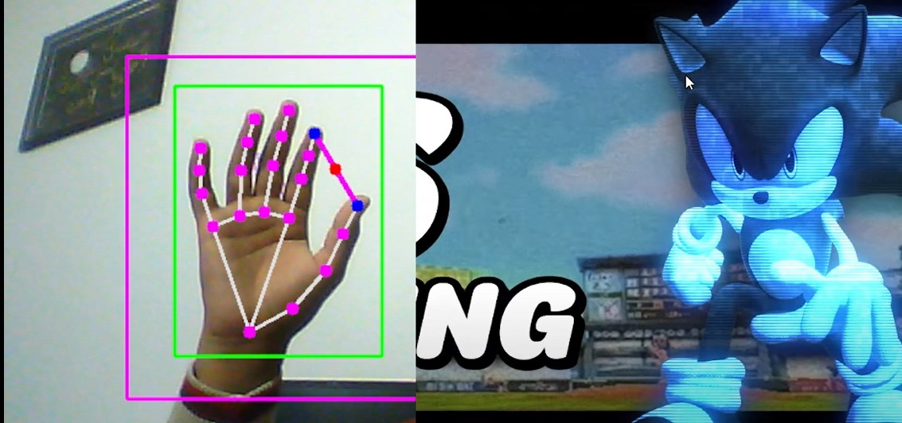

# Virtual Cursor Using Computer Vision  

  

A virtual cursor powered by computer vision that tracks the index finger's movement to control the cursor and uses a thumb-to-index finger gesture to simulate a mouse click. Inspired by Apple Vision's interaction and improved upon the original tutorial by Murtaza Hassan.  

## Features  
- **Cursor Control:** Move the cursor with your index finger.  
- **Click Gesture:** Perform a mouse click by touching your thumb to your index finger.  
- **Enhanced Interaction:** Improved click gesture from the original middle-finger-to-index-finger design.  
## Requirements  
To run this project, you need the following:  
- Python 3.x  
- A webcam or external camera  
- Required Python packages (listed in `requirements.txt`)  

## Installation  

1. **Clone the Repository**  
   ```bash
   git clone https://github.com/zaidimurtaza/Virtual-Cursor.git
   cd HandGesture
   ```

2. **Create a Virtual Environment**
    ```bash
    python -m venv <name>
    ```
3. **Activate VENV**
    ```bash
        venv\Script\activate
    ```
4. **Go to virtual_cursor.py**
